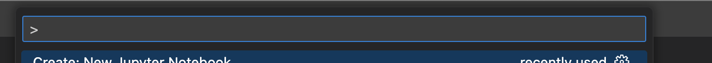
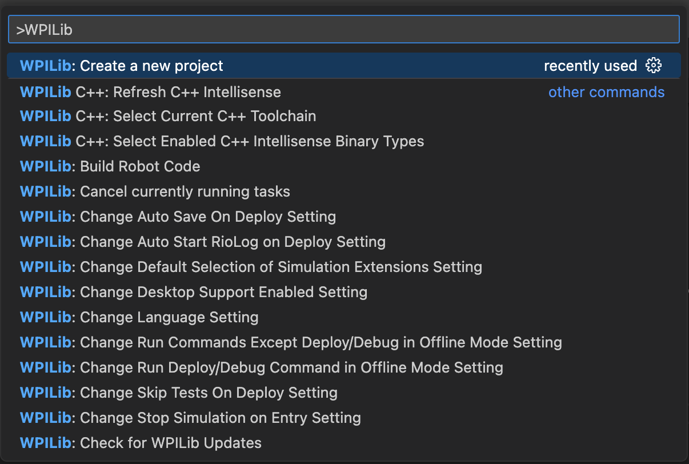
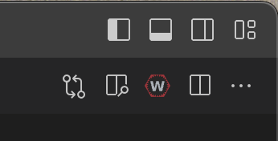
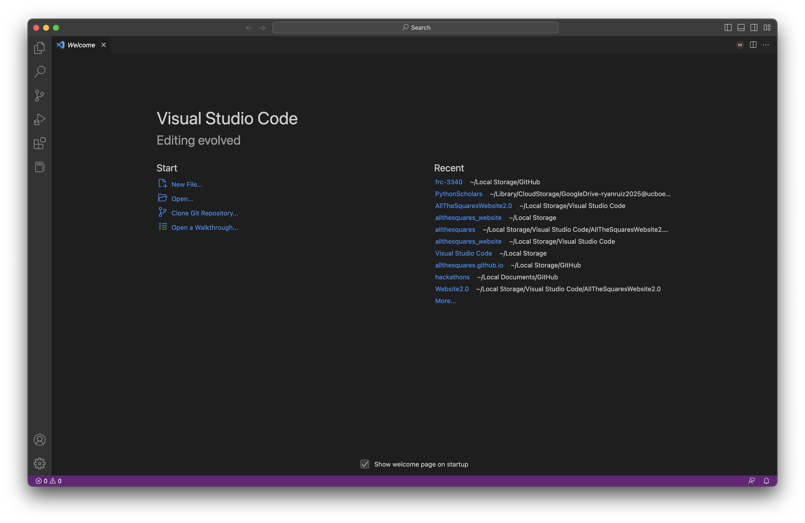
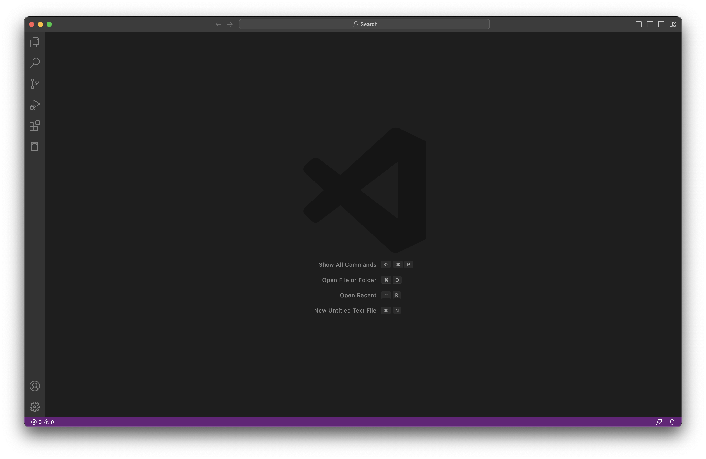

# Welcome to the FRC #3340 Robot Code Repository.

This repository contains the robot code written by the coding subteam of the "MagneGeeks".
If you have access to this page, you have full access to our code for our robots.

## Notes:

- [Please read the official FIRST/WPILib documentation while programming the robot.](https://docs.wpilib.org/en/stable/index.html)
  - The documentation is a useful tool for viewing the methods or classes you may need to drive the robot.
- All project folders will follow the format of \(Year)\_\(Competition Game)\_RobotCode.
- If you see any weird file types, such as AppleDoubles or DS\_\Store files, feel free to remove them. macOS does this for their purposes.
- Projects can be created using either Java or C++. Use whichever language you are more comfortable with.

### Coding @ Home:

If you wish to code at home:

- Download and run the [WPILib Installer](https://docs.wpilib.org/en/stable/docs/zero-to-robot/step-2/index.html).

  - Be sure to download Visual Studio Code provided by the installer, as it comes packaged with the latest version of the WPILib extension and Eclipse Adoptium JDK.
  - Once you finish, **[click here to learn about how to use WPILib and VS Code.](https://github.com/AllTheSquares/frc-3340#using-wpilib)**

- Download either or both of these source control tools:
  - **[GitHub Desktop](https://desktop.github.com/)** - an easy-to-use, user-interface based application that allows for easy code changes and retrievals
    - [Click here to learn how to use GitHub Desktop.]
  - **[Git for your OS](https://git-scm.com/downloads)** - a terminal-based utility that offers source control directly from the terminal. Recommended for masochists or if you want to enable source control directly from Visual Studio Code.
    - [Click here to view the commands that we will use with Git.]

When using Git from the terminal:

- Update changes with **git add .**
- Commit to the repository with **git commit -m "(comment)"**
- Push your changes to the repository for everyone with **git push**
- Get any code changes with **git pull**

## Properly using this repository:

To make everyone's lives easier when using this repository, it is highly recommended to:

- Describe your commits properly, explaining what you changed or removed in the code.
- Keep the code organized, giving appropriate file and variable names. [Visual Studio Code offers tools for this.]()
- Not sabotage the code and/or the team. All changes to the repository are tracked and can be reversed.
- Discuss your changes in the #coding channel on the [FRC 3340 Discord server](https://discord.gg/8gNydQ4pcF).

## Using WPILib

**Always open WPILib's version of VS Code.** Do not use the version that you download directly from Microsoft, as the WPILib extension may be out of date.

In VS Code, access the command pallete by pressing Ctrl + Shift + P (⌘ + ⇧ + P on macOS). You should see something like this:

Typing "WPILib" will give you many options. [Click here to view all the options.](https://docs.wpilib.org/en/stable/docs/software/vscode-overview/wpilib-commands-vscode.html)

_Tip: You can also access the WPILib commands by clicking on the WPILib icon on the top right of your screen._

## Visual Studio Code:

Visual Studio Code is a very popular IDE, and is also easy to use and learn. By default, VS Code has "IntelliSense", which can help you catch errors and/or complete lines of code.

You can also add extensions and color themes to your copy of VS Code to personalize it. Please avoid using IntelliCode, an extension offered by Microsoft, however. According to WPI, it breaks IntelliSense for WPILib.

It is highly recommended to install the Prettier extension to clean up your code upon every save.

### Using VS Code:

By default, opening VS Code will display etiher the Welcome, Getting Started, or blank page:

Happy coding, coding team :)
